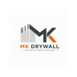

# MK Drywall Soluções — Site Institucional

Site premium em HTML, CSS e JavaScript puro para conversão de orçamentos via WhatsApp.

## Estrutura

- `index.html` — Página principal com SEO e dados estruturados
- `style.css` — Estilos mobile-first
- `script.js` — Animações, lightbox, formulário e WhatsApp
- `assets/logo.svg` — Logo placeholder (substitua pela logo oficial)

## Publicação

1. Substitua `assets/logo.svg` (ou use `assets/logo.png` e atualize os `src` no HTML).
2. Troque as imagens da galeria em `index.html` pelas fotos reais das obras.
3. Envie todos os arquivos para seu provedor (Netlify, Hostinger, etc.).

## Logo oficial

Coloque o arquivo da logo em `assets/` (ex.: `logo.png`) e altere em `index.html`:

```html

```

## Desenvolvimento local

Abra `index.html` no navegador ou use uma extensão Live Server no VS Code/Cursor.
